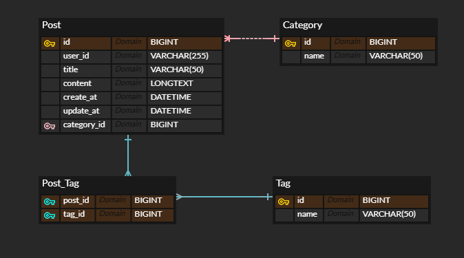

## 📅 2026-03-09
### ✅ 진행 상황
- Spring Boot 4.0.3 & Vue 3(Vite) 프로젝트 초기 생성
- 루트 `.gitignore` 설정 및 GitHub 원격 저장소 연결 완료
- 프로젝트 상세 명세서(`SPECIFICATION.md`) 작성

### 🛠 트러블슈팅
- **이슈**: Node.js 설치 후 VS Code 터미널에서 `npm` 인식 불가
- **원인**: 시스템 환경 변수(Path) 반영 지연
- **해결**: `npm.cmd` 절대 경로 사용하여 우선 진행, 추후 재부팅 예정

### 💡 결정 사항
- `application.properties`는 보안상 Git 제외 (로컬에서만 관리)
- 업데이트 기록과 트러블슈팅은 명세서와 분리하여 `LOG.md`에서 통합 관리

---

## 📅 2026-03-10
### ✅ 1. 데이터베이스 ERD 설계 완료
게시글(Post)을 중심으로 카테고리와 태그가 유기적으로 연결되는 구조를 확정했습니다.

#### **[테이블 상세 구조]**
| 테이블명 | 역할 | 주요 컬럼 (Physical Name) | 타입 | 비고 |
| :--- | :--- | :--- | :--- | :--- |
| **Post** | 게시글 본체 | `id`, `user_id`, `title`, `content`, `category_id` | BIGINT, VARCHAR, LONGTEXT, BIGINT | 주인공 (N) |
| **Category** | 게시판 분류 | `id`, `name` | BIGINT, VARCHAR(50) | 부모 (1) |
| **Tag** | 태그 마스터 | `id`, `name` | BIGINT, VARCHAR(50) | 고유 키워드 |
| **Post_Tag** | N:M 매핑 | `post_id`, `tag_id` | BIGINT, BIGINT | 변환 테이블 |

#### **[관계 정의]**
- **Category(1) : Post(N)**: `Post`가 `category_id`(FK)를 가짐으로써 계층 구조 형성.
- **Post(N) : Tag(M)**: `Post_Tag` 매핑 테이블을 통해 한 글에 여러 태그, 한 태그에 여러 글 연결 가능.

### 🛠 2. 오늘의 트러블슈팅
- **이슈**: VS Code 내부 터미널에서 `npm` 명령어 인식 불가 (`CommandNotFoundException`).
- **원인**: Node.js 설치 후 PowerShell 환경 변수(Path) 즉시 반영 지연.
- **해결**: 
  1. 실행 터미널을 **Command Prompt(cmd)**로 변경하여 작동 확인.
  2. 에디터 재시작 후 **PowerShell**에서도 정상 인식됨을 최종 확인.
- ※ 환경 변수 설정 후에는 터미널을 완전히 새로 열어보거나 시스템 재부팅 후 재시도

### 💡 향후 확장 계획
- **Member 연동**: `Post.user_id`를 기반으로 추후 회원 테이블(ID/닉네임 중복 방지, 비번 암호화)과 연계 예정.
- **태그 로직**: 태그 수정 시 기존 매핑을 끊고 새 ID를 연결하는 방식으로 '공유 자원' 사이드 이펙트 방지.

---

## 📅 2026-03-11
### ✅ 1. 데이터베이스 스키마 설계 및 구축
- **SQL 스키마 작성**: `Post`, `Category`, `Tag`, `Post_Tag` 테이블 구조 설계.
- **초기화 스크립트 생성**: 데이터베이스 생성을 위한 `init.sql` 파일 작성 및 적용.
- **제약 조건 설정**: PK(자동 증가), FK(외래 키 참조), `ON DELETE CASCADE`를 통한 데이터 무결성 확보.

### ✅ 2. API 명세서 설계
- **파일명**: `SeedLog_Spec-v1.md`
- **핵심 기능 정의**: 게시글 CRUD(페이징 포함), 카테고리 관리, 태그 기반 필터링 조회 등 총 11개의 엔드포인트 설계.
- **데이터 규격**: RESTful 원칙에 따른 HTTP 메서드(GET, POST, PUT, DELETE) 및 JSON 요청/응답 구조 확정.

### ✅ 3. 환경 설정 및 기기 동기화
- **Git 워크플로우**: 노트북과 PC 간의 작업 동기화를 위한 `rebase` 기반의 pull/push 프로세스 정립.
- **DB 연결**: MySQL Workbench 환경 세팅 및 로컬 DB 연결 확인.

### 🛠 트러블 슈팅
- **특이사항 없음**: 어제 발생했던 경로 및 환경 변수 이슈 해결 후 안정적으로 진행됨.

### 🚀 향후 확장 계획
- **DB 확장**: 회원 관리(User), 댓글(Comment) 등 기능 추가에 따른 테이블 확장.
- **API 확장**: 데이터베이스 구조 변경에 맞춰 명세서 업데이트 및 버전 관리(`v1` -> `v2`).
- **개발 착수**: 설계된 명세서를 바탕으로 Spring Boot 프로젝트의 Entity 및 Repository 계층 구현.

---

## 📅 2026-03-12
### 📈 진행 상황
- **기기 이동에 따른 환경 재구축**: PC에서 노트북으로 작업 환경을 이동하며 발생한 빌드 오류 및 설정 불일치 완전 해결.
- **도메인 모델 구체화**: 설계된 SQL 스키마를 바탕으로 Spring Boot 프로젝트의 핵심 Entity 계층 구현 완료.

### ✅ 진행 작업
- **패키지 구조 수립**: `controller`, `service`, `entity`, `repository` 4계층 구조 확립.
- **JPA 엔티티 매핑**:
    - `Post`, `Category`, `Tag` 엔티티 구현 및 관계 설정.
    - `Post_Tag` 매핑 엔티티 구현: DB의 복합키 구조를 JPA 관리 효율성을 위해 대리 키(Surrogate Key) 전략으로 변환하여 적용.
    - `@ManyToOne(fetch = FetchType.LAZY)` 적용을 통한 쿼리 최적화 기틀 마련.
- **Spring Boot 3.x 환경 최적화**: `jakarta.persistence` 기반의 영속성 계층 설정 완료.

### 🛠 트러블 슈팅
- **Gradle Java Home 경로 불일치**: 노트북 환경의 JDK 경로 인식 문제로 빌드 실패 발생. 프로젝트 클린 리셋 및 Git 재배포를 통해 경로 설정 동기화 성공.
- **Lombok 라이브러리 미작동**: STS IDE 내 `sts.ini` 파일의 `-javaagent` 경로 수동 수정을 통해 어노테이션 프로세싱 문제 해결.
- **Persistence 패키지 이슈**: Spring Boot 3.0 이상 버전에서 `javax.persistence`가 `jakarta.persistence`로 변경됨에 따른 임포트 오류 해결.
  
---
