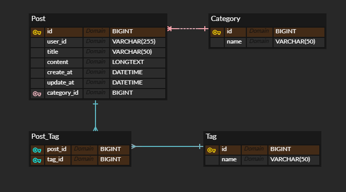

## 📅 2026-03-09
### ✅ 진행 상황
- Spring Boot 4.0.3 & Vue 3(Vite) 프로젝트 초기 생성
- 루트 `.gitignore` 설정 및 GitHub 원격 저장소 연결 완료
- 프로젝트 상세 명세서(`SPECIFICATION.md`) 작성

### 🛠 트러블슈팅
- **이슈**: Node.js 설치 후 VS Code 터미널에서 `npm` 인식 불가
- **원인**: 시스템 환경 변수(Path) 반영 지연
- **해결**: `npm.cmd` 절대 경로 사용하여 우선 진행, 추후 재부팅 예정

### 💡 결정 사항
- `application.properties`는 보안상 Git 제외 (로컬에서만 관리)
- 업데이트 기록과 트러블슈팅은 명세서와 분리하여 `LOG.md`에서 통합 관리

---

## 📅 2026-03-10
### ✅ 1. 데이터베이스 ERD 설계 완료
게시글(Post)을 중심으로 카테고리와 태그가 유기적으로 연결되는 구조를 확정했습니다.

#### **[테이블 상세 구조]**
| 테이블명 | 역할 | 주요 컬럼 (Physical Name) | 타입 | 비고 |
| :--- | :--- | :--- | :--- | :--- |
| **Post** | 게시글 본체 | `id`, `user_id`, `title`, `content`, `category_id` | BIGINT, VARCHAR, LONGTEXT, BIGINT | 주인공 (N) |
| **Category** | 게시판 분류 | `id`, `name` | BIGINT, VARCHAR(50) | 부모 (1) |
| **Tag** | 태그 마스터 | `id`, `name` | BIGINT, VARCHAR(50) | 고유 키워드 |
| **Post_Tag** | N:M 매핑 | `post_id`, `tag_id` | BIGINT, BIGINT | 변환 테이블 |

#### **[관계 정의]**
- **Category(1) : Post(N)**: `Post`가 `category_id`(FK)를 가짐으로써 계층 구조 형성.
- **Post(N) : Tag(M)**: `Post_Tag` 매핑 테이블을 통해 한 글에 여러 태그, 한 태그에 여러 글 연결 가능.



### 🛠 2. 오늘의 트러블슈팅
- **이슈**: VS Code 내부 터미널에서 `npm` 명령어 인식 불가 (`CommandNotFoundException`).
- **원인**: Node.js 설치 후 PowerShell 환경 변수(Path) 즉시 반영 지연.
- **해결**: 
  1. 실행 터미널을 **Command Prompt(cmd)**로 변경하여 작동 확인.
  2. 에디터 재시작 후 **PowerShell**에서도 정상 인식됨을 최종 확인.
- ※ 환경 변수 설정 후에는 터미널을 완전히 새로 열어보거나 시스템 재부팅 후 재시도


### 💡 향후 확장 계획
- **Member 연동**: `Post.user_id`를 기반으로 추후 회원 테이블(ID/닉네임 중복 방지, 비번 암호화)과 연계 예정.
- **태그 로직**: 태그 수정 시 기존 매핑을 끊고 새 ID를 연결하는 방식으로 '공유 자원' 사이드 이펙트 방지.

---

## 📅 2026-03-11
### ✅ 1. 데이터베이스 스키마 설계 및 구축
- **SQL 스키마 작성**: `Post`, `Category`, `Tag`, `Post_Tag` 테이블 구조 설계.
- **초기화 스크립트 생성**: 데이터베이스 생성을 위한 `init.sql` 파일 작성 및 적용.
- **제약 조건 설정**: PK(자동 증가), FK(외래 키 참조), `ON DELETE CASCADE`를 통한 데이터 무결성 확보.

### ✅ 2. API 명세서 설계
- **파일명**: `SeedLog_Spec-v1.md`
- **핵심 기능 정의**: 게시글 CRUD(페이징 포함), 카테고리 관리, 태그 기반 필터링 조회 등 총 11개의 엔드포인트 설계.
- **데이터 규격**: RESTful 원칙에 따른 HTTP 메서드(GET, POST, PUT, DELETE) 및 JSON 요청/응답 구조 확정.

### ✅ 3. 환경 설정 및 기기 동기화
- **Git 워크플로우**: 노트북과 PC 간의 작업 동기화를 위한 `rebase` 기반의 pull/push 프로세스 정립.
- **DB 연결**: MySQL Workbench 환경 세팅 및 로컬 DB 연결 확인.

### 🛠 트러블 슈팅
- **특이사항 없음**: 어제 발생했던 경로 및 환경 변수 이슈 해결 후 안정적으로 진행됨.

### 🚀 향후 확장 계획
- **DB 확장**: 회원 관리(User), 댓글(Comment) 등 기능 추가에 따른 테이블 확장.
- **API 확장**: 데이터베이스 구조 변경에 맞춰 명세서 업데이트 및 버전 관리(`v1` -> `v2`).
- **개발 착수**: 설계된 명세서를 바탕으로 Spring Boot 프로젝트의 Entity 및 Repository 계층 구현.

---

## 📅 2026-03-12
### 📈 진행 상황
- **기기 이동에 따른 환경 재구축**: PC에서 노트북으로 작업 환경을 이동하며 발생한 빌드 오류 및 설정 불일치 완전 해결.
- **도메인 모델 구체화**: 설계된 SQL 스키마를 바탕으로 Spring Boot 프로젝트의 핵심 Entity 계층 구현 완료.

### ✅ 진행 작업
- **패키지 구조 수립**: `controller`, `service`, `entity`, `repository` 4계층 구조 확립.
- **JPA 엔티티 매핑**:
    - `Post`, `Category`, `Tag` 엔티티 구현 및 관계 설정.
    - `Post_Tag` 매핑 엔티티 구현: DB의 복합키 구조를 JPA 관리 효율성을 위해 대리 키(Surrogate Key) 전략으로 변환하여 적용.
    - `@ManyToOne(fetch = FetchType.LAZY)` 적용을 통한 쿼리 최적화 기틀 마련.
- **Spring Boot 3.x 환경 최적화**: `jakarta.persistence` 기반의 영속성 계층 설정 완료.

### 🛠 트러블 슈팅
- **Gradle Java Home 경로 불일치**: 노트북 환경의 JDK 경로 인식 문제로 빌드 실패 발생. 프로젝트 클린 리셋 및 Git 재배포를 통해 경로 설정 동기화 성공.
- **Lombok 라이브러리 미작동**: STS IDE 내 `sts.ini` 파일의 `-javaagent` 경로 수동 수정을 통해 어노테이션 프로세싱 문제 해결.
- **Persistence 패키지 이슈**: Spring Boot 3.0 이상 버전에서 `javax.persistence`가 `jakarta.persistence`로 변경됨에 따른 임포트 오류 해결.

---

## 📅 2026-03-13
### 📈 진행 상황
- **백엔드 핵심 아키텍처 가동**: `Controller-Service-Repository`로 이어지는 비즈니스 로직의 흐름을 완성하고 실제 구동 확인.
- **데이터 영속성 검증**: 실제 MySQL 데이터베이스와의 연동을 통해 데이터 저장 및 스키마 자동 생성 프로세스 검증 완료.

### ✅ 진행 작업
- **API 레이어 구현**:
- `PostController`: RESTful한 게시글 생성(`POST`), 수정(`PUT`), 삭제(`DELETE`) 엔드포인트 구축.
- `PostService`: `@Transactional`을 활용한 비즈니스 로직 및 JPA의 변경 감지(Dirty Checking) 메커니즘 적용.

* **DB 인프라 구축**:
- MySQL 데이터베이스 스키마 생성 및 연동 테스트.
- `application.properties` 설정을 통한 JPA 데이터 소스 및 Hibernate DDL 옵션(`create`/`update`) 최적화.

### 🛠 트러블 슈팅
- **MySQL 'Unknown database' 에러**: 물리적인 데이터베이스(Schema) 부재로 인한 기동 실패 발생. CMD 환경에서 `CREATE DATABASE` 명령을 통해 해결.
- **Lombok `@RequiredArgsConstructor` 인식 오류**: IDE 환경 문제로 인한 `final` 필드 미초기화 에러 발생. 수동 생성자 주입 방식으로 우회하여 서비스 로직의 안정성 확보.
- **JPA 양방향 매핑 오타 (`catetory`)**: `Post`와 `Category` 엔티티 간 `mappedBy` 설정 시 발생한 필드명 오타를 발견하여 수정. 런타임 시의 `AnnotationException` 해결.
- **Hibernate 스키마 검증 실패**: 기존 DB 구조와 자바 엔티티 간의 불일치로 인한 `SchemaManagementException` 발생. `ddl-auto=create` 옵션을 통해 테이블 구조를 동기화하여 해결.
- **HTTP 405 Method Not Allowed**: 브라우저 주소창(GET)을 통한 POST API 접근 시 발생한 핸들러 미매핑 이슈 확인. API 요청 메서드와 컨트롤러 매핑의 일치 필요성 확인.

-----

## 📅 2026-03-17
### 📈 진행 상황
  - **Spring Boot 4계층 아키텍처 이론 정립**: `Controller-Service-Repository-Entity`로 이어지는 계층별 역할과 책임(Responsibility)을 명확히 정의하고 학습 내용 블로그 포스팅 완료.
  - **Lombok 라이브러리 정상화**: 설정 오류 해결을 통해 도메인 및 서비스 계층의 보일러플레이트 코드를 제거하고 프로젝트 구조 최적화.

### ✅ 진행 작업
  - **계층별 학습 기록 및 블로그 포스팅**:
      - [**Controller**](https://velog.io/@dong20/Spring-Boot의-4계층-1-Controller): 외부 요청을 수신하고 응답을 반환하는 **'입구의 문지기'** 역할 정리.
      - [**Service**](https://velog.io/@dong20/Spring-Boot-4계층-구조-2-Service): 비즈니스 로직을 판단하고 트랜잭션을 관리하는 **'실세(두뇌)'** 역할 정리.
      - [**Repository**](https://velog.io/@dong20/Spring-Boot-4계층-구조-3-Repository-fmakqgh2): 인터페이스 기반의 데이터 접근 계층, 현대판 DAO인 **'창고지기'** 역할 정리.
      - [**Entity**](https://velog.io/@dong20/Spring-Boot-4계층-구조-4-Entity): DB 테이블과 매핑되는 시스템의 본질이자 핵심인 **'데이터 목록표'** 역할 정리.

  - **Lombok 기반 리팩토링**:
      - 트러블 슈팅 해결 후, 기존 엔티티 및 클래스에 `@Getter`, `@NoArgsConstructor` 등을 적용하여 수동 작성 코드를 어노테이션 기반으로 전량 수정.

### 🛠 트러블 슈팅
  - **Lombok 어노테이션 프로세싱 오류**: 라이브러리 의존성 추가 후에도 컴파일 시점에 Getter/Setter 등을 인식하지 못하는 문제 발생.
      - **원인**: 컴파일러 설정 옵션 기입 과정에서 하이픈 오탈자 확인 (`--` 이중 하이픈 사용).
      - **해결**: 단일 하이픈(`-`)으로 수정 후 정상 작동 확인.
  - **아키텍처 설계 원리에 대한 오해**: "왜 굳이 이렇게 나눠야 하지?"라는 근본적인 의문에서 출발.
      - **해결**: 학습을 통해 각 계층의 역할을 명확히 인식하게 되면서, 계층 분리가 유지보수와 관심사 분리(SoC)를 위한 필수적인 설계임을 이해함. (상세 내용은 블로그 포스팅 참조)

-----

## 📅 2026-03-18
### 📈 진행 상황
- **DB 설계의 정석**: 데이터 무결성(Integrity) 및 정규화(Normalization) 이론 학습.
- **Velog 기술 포스팅**: [[DB] 데이터 무결성과 정규화(1NF~BCNF) 정리.](https://velog.io/@dong20/DB-데이터-무결성과-정규화Normalization)

### ✅ 진행 작업
- **데이터 무결성 3대장 정립**:
    - **개체 무결성**: PK는 중복 불가, NULL 불가 (데이터 고유성).
    - **참조 무결성**: FK는 참조 대상이 존재해야 함 (연관 데이터 일관성).
    - **도메인 무결성**: 속성 값의 타입과 범위 제한 (데이터 유효성).
- **정규화(Normalization) 단계별 정복**:
    - **이상 현상(Anomaly)**: 삽입/갱신/삭제 이상의 위험성 분석.
    - **1NF**: 원자 값 확보.
    - **2NF**: 복합키 사용 시 부분 함수 종속 제거.
    - **3NF**: 일반 컬럼 간의 이행 함수 종속 제거.
    - **BCNF**: 모든 결정자가 후보키(Candidate Key)가 되도록 엄격하게 분해.

---

## 📅 2026-03-19
### 📈 진행 상황
- **글로벌 예외 처리(Global Exception Handling) 아키텍처 구축**: 시스템 전반의 에러 응답 규격화 및 안정성 확보.
- **프로젝트 패키지 구조 최적화**: `global.error` 패키지 분리를 통한 관심사 분리(SoC) 적용.

### ✅ 진행 작업
- **Error Architecture 설계**:
    - **ErrorCode (Enum)**: 비즈니스 에러 코드 및 메시지 중앙 관리 체계 구축.
    - **ErrorResponse (DTO)**: `timestamp`, `status`, `code`, `message`를 포함한 표준 응답 규격 정의.
    - **GlobalExceptionHandler**: `@RestControllerAdvice`를 활용하여 프로젝트 전체 예외를 한곳에서 처리하도록 구현.
- **Custom Exception 계층화**:
    - 최상위 비즈니스 예외인 `BusinessException` 정의.
    - 입력값 검증 전용 `InvalidValueException` 등 세부 예외 클래스 확장.
    - 다양한 상황에 대응하기 위해 부모 클래스(`BusinessException`) 생성자 오버로딩 적용.

### 🛠 트러블 슈팅
- **LocalDateTime 생성 방식 오류**: 
    - `new LocalDateTime()` 시도 시 컴파일 에러 발생 -> 정적 팩토리 메서드인 `LocalDateTime.now()`로 수정하여 해결.
- **serialVersionUID 누락 경고**: 
    - `Exception` 상속 시 직렬화 버전 관리 필드 미선언 확인 -> `private static final long serialVersionUID = 1L;` 명시적 선언으로 정합성 확보.
- **부모 생성자 호출(super) 불일치**: 
    - 자식 클래스에서 커스텀 메시지를 넘길 때 부모 클래스에 해당 생성자가 없어 에러 발생 -> `BusinessException(String, ErrorCode)` 생성자 추가 정의.

---

### 📅 2026-03-20
### 📈 진행 상황
- **게시글(Post) 도메인 DTO 아키텍처 설계 완료**: 계층 간 데이터 전송 규격 확립 및 보안성 강화.
- **응답 데이터 최적화(Payload Optimization)**: 목록 조회와 상세 조회의 응답 객체 분리를 통한 성능 효율성 확보.
- **DTO 패키지 구조 고도화**: `request`와 `response` 전용 패키지 분리로 유지보수성 향상.

### ✅ 진행 작업
- **DTO Layering & Packaging**:
    - `dto.request`: `CreateRequestDTO`, `UpdateRequestDTO`, `SelectPostRequest` (입력값 검증 및 요청 데이터 캡슐화).
    - `dto.response`: `PostListResponseDTO`, `PostDetailResponseDTO`, `SelectTagResponseDTO` (출력 데이터 선별 및 가공).
- **Context-Specific DTO 설계**:
    - **목록용(List)**: 본문(`content`)을 제외하고 `id`, `title`, `categoryName`, `createAt`만 포함하여 네트워크 부하 감소.
    - **상세용(Detail)**: 본문 및 태그 리스트를 포함한 전체 데이터 제공.
- **RESTful 식별 전략 수립**:
    - 수정/삭제 시 대상 ID를 DTO가 아닌 URL Path Variable(`{id}`)로 수신하도록 설계하여 표준 준수.

### 🛠 트러블 슈팅
- **Entity 직접 노출의 위험성 인지**: 
    - 엔티티를 API 응답으로 보낼 경우 내부 DB 구조가 노출되고 순환 참조 발생 가능성 확인 -> 어노테이션이 없는 순수 POJO인 DTO로 변환하여 반환하도록 구조 개선.
- **정렬 기준 필드 선정 고민**: 
    - DB ID(`Long`)와 생성일(`LocalDate`) 중 정렬 기준 고민 -> 사용자에게 직관적인 정보를 제공하기 위해 `createAt` 필드를 DTO에 포함하여 응답 규격 확정.
- **카테고리 매핑 전략**: 
    - 입력 시에는 관리 효율을 위해 `categoryId(Long)`를 받고, 출력 시에는 사용자 가독성을 위해 `categoryName(String)`으로 변환하여 제공하는 전략 채택.

### 📂 파일 구조 변경 (Post Domain)
```text
post
├── 📁 controller
│   └── 📄 PostController.java
├── 📁 dto
│   ├── 📁 request
│   │   ├── 📄 CreateRequestDTO.java
│   │   ├── 📄 SelectPostRequest.java
│   │   └── 📄 UpdateRequestDTO.java
│   └── 📁 response
│       ├── 📄 PostDetailResponseDTO.java
│       ├── 📄 PostListResponseDTO.java
│       └── 📄 SelectTagResponseDTO.java
├── 📁 entity
│   ├── 📄 Category.java
│   ├── 📄 Post.java
│   ├── 📄 PostTag.java
│   └── 📄 Tag.java
├── 📁 repository
│   ├── 📄 CategoryRepository.java
│   ├── 📄 PostRepository.java
│   ├── 📄 PostTagRepository.java
│   └── 📄 TagRepository.java
└── 📁 service
    └── 📄 PostService.java
```

---

## 📅 2026-03-23
### 📈 진행 상황
- **비즈니스 로직(Service Layer) 핵심 구현 완료**: 게시글 생성(Create), 수정(Update), 삭제(Delete) 기능의 안정적 구현 및 검증.
- **도메인 전 계층 주석 표준화(Javadoc Coating)**: Entity, DTO, Repository, Service 전반에 걸친 기술적 의도 명시 및 문서화 완료.

### ✅ 진행 작업
- **PostService 로직 고도화**:
    - **ID 기반 분류 전략 확정**: 클라이언트와 서버 간 통신 시 명칭(String)이 아닌 고유 식별자(ID)를 사용하여 데이터 매핑의 정확성 및 무결성 확보.
    - **연관 관계 처리 로직**: 게시글 저장/수정 시 카테고리 존재 여부를 우선 검증하고, 태그(Tag)의 '조회 후 자동 생성' 프로세스 구축.
    - **Dirty Checking 최적화**: 수정(`updatePost`) 시 별도의 `save()` 호출 없이 엔티티 상태 변경만으로 반영되는 JPA 메커니즘 활용.
- **Javadoc 표준 가이드라인 적용**:
    - **구조적 문서화**: `<p>` 태그를 활용한 단락 구분을 통해 IDE 툴팁 및 API 문서의 시독성 확보.
    - **도메인 지식 전파**: 연관 관계 편의 메서드 및 JPA Auditing 필드에 대한 상세 설명을 추가하여 코드 가독성 증대.

### 🛠 트러블 슈팅
- **카테고리 매핑 전략의 전환**: 
    - 단순 이름 기반 조회의 한계(중복, 계층 구조 대응 불가)를 인지하고, 웹이 보유한 ID 정보를 활용하는 **ID-Based Mapping**으로 설계 변경.
- **Javadoc 렌더링 최적화**: 
    - 주석 작성 시 문단이 겹쳐 보이는 현상을 해결하기 위해 자바 표준 HTML 태그인 `<p>`를 재도입하여 레이아웃 정렬.

---

## 📅 2026-03-26
### 📈 진행 상황
- **백엔드 기본 세팅 완료**: Post 도메인의 핵심 비즈니스 로직(CRUD) 및 Controller API 설계 완료.
- **학습 페이즈 전환**: 향후 추가될 확장 기능(Tag/Category 고도화, User 로그인)과 Read(조회) 성능 최적화를 위해 DB 및 SQL 집중 학습 시작.

### ✅ 진행 작업 및 학습 내용
- **프로그래머스 SQL Lv.1 정복 (약 25문제 완료)**
- **SQL 문법 정석 및 실무 디테일 요약**:
  - **데이터 조회 및 가공 (`SELECT`)**: 
    - `COALESCE`: `NULL` 값을 처리하는 표준적이고 간결한 방법 확보.
    - `DATE_FORMAT`: 불필요한 시간 정보 제거 및 포맷팅.
    - `ROUND`: 소수점 데이터 정제.
  - **조건 필터링 (`WHERE`)**:
    - `IN`: 다중 `OR` 조건을 묶어 가독성 향상.
    - `LIKE`: 와일드카드(`%`) 위치에 따른 인덱스 활용 효율성 인지.
    - `YEAR`: 직관적인 연도 추출 및 비교.
  - **날짜 계산 (`DATEDIFF`)**:
    - `DATEDIFF(종료일, 시작일) + 1`: 실무에서 가장 빈번하게 발생하는 '당일 포함 여부' 디테일 학습.
  - **테이블 결합 및 정렬 (`JOIN`, `ORDER BY`)**:
    - ANSI 표준 `JOIN` 구조와 테이블 별칭(Alias)을 활용한 쿼리 가독성 극대화.
    - 여러 기준을 순차적으로 적용하는 다중 정렬(`DESC`, `ASC`) 처리.
  - **문법 표준 (따옴표 표기법)**:
    - 값(Data): 홑따옴표(`' '`)
    - 별칭(Alias): 생략 또는 쌍따옴표(`" "`)
    - 식별자(Identifier): 공백/예약어 포함 시 쌍따옴표(`" "`) 또는 백틱(`` ` ``)
  
-----

## 📅 2026-04-09

### 📈 진행 상황

  - **DB 쿼리문 학습**: RECEIPT ERD 설계 및 프로그래머스 문제를 통해 DB 및 SQL 쿼리문 학습 완료.
  - **ERD 2차 설계**: 카테고리, 태그 등 핵심 기능 확정 및 ERD 확장 설계 적용.

### ✅ 진행 작업 및 학습 내용

  - **2026.03.26 \~ 2026.04.09 프로그래머스 SQL Lv.1 \~ Lv.4 정복 (총 103문제 해결)**
  - **RECEIPT 시나리오 ERD 설계**:
      - [RECEIPT 학습 1 (2026.04.01)](https://velog.io/@dong20/ERD-모델링-RECEIPT-feat.-AI-아키텍처-리뷰)
      - [RECEIPT 학습 2 (2026.04.06)](https://velog.io/@dong20/ERD-모델링-RECEIPT-2-feat.-AI-아키텍처-리뷰)
  - **카테고리, 태그 등 기능 확정 및 로그인 기능을 추가하여 ERD 확장**
  - **ERD 주요 변동 사항**:
      - Category 세분화 ➔ `MAIN_CATEGORY`, `SUB_CATEGORY`
      - 유저 도메인 분리 ➔ `USER_INFO`, `USER_IMAGE` 테이블 분할 추가
      - `POST` 테이블 ➔ 게시글 삭제 여부(Soft Delete)를 위한 `flag` 칼럼 추가
  


### 🛠 트러블 슈팅

  - **카테고리 조회 병목 현상 (계층 구조 누락)**
      - **문제**: 최초 설계 시 메인 카테고리와 서브 카테고리를 논리적인 트리 구조로 의도했으나, 실제 물리적 ERD에는 연관 관계가 반영되지 않음.
      - **해결**: `MAIN_CATEGORY` 테이블과 `SUB_CATEGORY` 테이블이 `1:N`으로 매핑되도록 FK(외래키)를 추가하여 정석적인 계층 구조로 ERD 수정.

### 🚀 추후 확장 고려 사항 (Future-Proof)

  - **POST 테이블 아키텍처 확장**
      - 데이터 누적 시 성능 저하를 방지하기 위해 최근 1\~2년 POST만 메인 테이블로 유지하고, 나머지는 `OLD_POST` 테이블로 이관하는 파티셔닝(Cold Storage) 전략 별도 고려.
  - **USER 데이터 라이프사이클 관리**
      - 컴플라이언스를 고려하여 탈퇴 후 일정 기간(ex. 5년)이 지난 유저의 물리적 정보 삭제 정책.
      - 최근 로그인 일자를 기반으로 한 휴면(Dormant) 계정 전환 로직 검토.

### 🧠 회고록
- [(velog) [ERD] Seed-Log ERD 2차 설계](https://velog.io/@dong20/ERD-Seed-Log-ERD-2차-설계)
  
-----

## 📅 2026-04-10

### 📈 진행 상황

  - **SQL 코드 수정**: user 관련 table 코드 추가, category 관련 table 코드 수정
  - **Post 패키지 내 Entity, Repository 수정**: 변경된 쿼리문 반영
  - **User 패키지 추가** : User 관련 쿼리문 반영

### ✅ 진행 작업 및 학습 내용

  - **SQL 쿼리문 변경**:
      - user_info, user_image, main_category, sub_category table CREATE 구문 추가
      - category CREATE 구문 삭제
      - post Table column 수정 
        - user_id, main_category_id, sub_category_id, is_deleted column 추가
        - category column 삭제
  - **SQL 변경 내용 Entity, Repository 반영**
      - PostEntity 코드 수정
      - CateogoryEntity, CategoryRepository -> MainCategoryEntity, MainCategoryRepository 로 변경
      - SubCategoryEntity, SubCategoryRepository 추가
  - **user package 추가**
      - entity, reposititory package 추가
  - **user.entity**
      - UserInfo, UserImage class 추가
  - **user.repository**
      - UserInfoRepository, UserImageRepository interface 추가

### 🛠 트러블 슈팅
  - **git pull fail**
      - **문제**: local과 github 코드가 불일치. git pull 동작시 Already up to date. 문구 출력
      - **조치**
        - **log 확인**: git log -n 1 --oneline, git log -n 1 origin/main --oneline 최신 커밋 기록 확인 결과 일치하는 것을 확인함
        - **git 강제 복구**: git reset --hard origin/main를 통해 local과 서버의 상태를 통일을 시도했지만, 여전히 같은 현상 발생
      - **해결**: local 파일 삭제 후 git clone으로 해결
  
  - **SQL calumn 표기 방식 통일**
      - **문제**: column 명칭 대소문자 혼용
      - **해결**: 데이터베이스 컬럼 명칭 소문자/언더바(_) 표기법으로 통일


### 📂 파일 구조 변경 (Post Domain, User Domain)
```text
post
├── 📁 controller
│   └── 📄 PostController.java
├── 📁 dto
│   ├── 📁 request
│   │   ├── 📄 CreateRequestDTO.java
│   │   ├── 📄 SelectPostRequest.java
│   │   └── 📄 UpdateRequestDTO.java
│   └── 📁 response
│       ├── 📄 PostDetailResponseDTO.java
│       ├── 📄 PostListResponseDTO.java
│       └── 📄 SelectTagResponseDTO.java
├── 📁 entity
│   ├── 📄 MainCategory.java
│   ├── 📄 SubCategory.java
│   ├── 📄 Post.java
│   ├── 📄 PostTag.java
│   └── 📄 Tag.java
├── 📁 repository
│   ├── 📄 MainCategoryRepository.java
│   ├── 📄 SubCategoryRepository.java
│   ├── 📄 PostRepository.java
│   ├── 📄 PostTagRepository.java
│   └── 📄 TagRepository.java
└── 📁 service
    └── 📄 PostService.java
```

```text
user
├── 📁 entity
│   ├── 📄 UserImage.java
│   └── 📄 UserInfo.java
└── 📁 repository
    ├── 📄 UserImageRepository.java
    └── 📄 UserInfoRepository.java
```
-----

## 📅 2026-04-14

### 📈 진행 상황
  - **Search 코드 작성**: 검색 관련 controller, service, repository, dto 작성 완료
  - **search, post 패키지 분리**: Post 내 검색 기능 구현에 따라 패키지 분리

### ✅ 진행 작업 및 학습 내용
  - **Search 코드 작성**
    - controller: PostSearchController.java 코드 작성
        - 클라이언트의 검색 요청에 따라 해당하는 게시글 반환
    - service: PostSearchService.java 코드 작성
        - 검색 type에 맞게 repository 호출
        - 전체 검색, 메인 카테고리, 서브 카테고리, 제목에 포함된 키워드, 사용자 아이디 기준 검색
    - repository : PostSearchRepository.java 코드 작성
        - findAll(Pageable pageable) : 조건 없이 전체 검색
        - findByMainCategory(@Param("mainId") Long mainId, Pageable pageable) : 메인 카테고리에 속한 게시글 검색
        - findBySubCategory(@Param("mainId") Long mainId, @Param("subId") Long subId, Pageable pageable) : 메인 -> 서브 카테고리에 속하는 게시글 검색
        - findByTitleKeyword(@Param("keyword") String keyword, Pageable pageable) : 타이틀에 포함된 키워드 기반 검색
        - findByUserId(@Param("userId") String userId, Pageable pageable) : 특정 유저가 작성한 게시글 검색
    - dto - request : PostSearchCondition.java 코드 작성
    - dto - responce : PostListDTO.java 코드 작성

### 🛠 트러블 슈팅
  - **Error : The local variable postPage may not have been initialized**
    - 원인 : postPage 변수가 초기화 되지 않음 
    - 해결 : null 값을 기본값으로 초기화
  - **Error : The method findByMainCategory(Long, DataWebProperties.Pageable) in the type PostSearchRepository is not applicable for the arguments (Long, Pageable)**
    - 원인 : Pageable 매개변수 타입 불일치
    - 해결 : Pageable import 경로 통일
        - 수정 전 : import org.springframework.boot.data.autoconfigure.web.DataWebProperties.Pageable;
        - 수정 후 : import org.springframework.data.domain.Pageable;

---

## 📅 2026-04-15

### 📈 진행 상황
  - **Post 모듈 CUD 고도화**: PostController, PostService, Post 엔티티의 생성/수정/삭제 로직 리팩토링 및 캡슐화
  - **JPA 최적화 적용**: 트랜잭션 관리 및 영속성 컨텍스트(Dirty Checking)를 활용한 업데이트 로직 개선

### ✅ 진행 작업 및 학습 내용
  - **Post 엔티티 객체지향적 설계 (Post.java)**
    - 무분별한 상태 변경을 막기 위해 클래스 레벨 `@Setter` 제거
    - 객체 생성 정합성을 보장하는 필수 파라미터 생성자 추가
    - 상태 변경을 위한 의미 있는 비즈니스 메서드 (`update()`) 도입으로 캡슐화 달성
  - **Post 서비스 계층 고도화 (PostService.java)**
    - CUD(생성/수정/삭제) 메서드에 `@Transactional`을 적용하여 데이터 정합성(원자성) 보장
    - JPA의 **Dirty Checking(변경 감지)** 메커니즘을 활용하여, 명시적인 `save()` 호출 없이 엔티티 상태 변경만으로 UPDATE 쿼리가 발생하도록 구조 개선
    - 태그 생성 및 연결을 처리하는 중복 로직을 `private` 메서드로 추출하여 가독성 향상
  - **Post 컨트롤러 API 규격 설계 (PostController.java)**
    - 클라이언트와의 명확한 소통을 위해 상태 코드(201 Created, 204 No Content 등)와 `ResponseEntity`를 활용한 응답 규격 통일성 검토

### 🛠 트러블 슈팅 및 깨달은 점
  - **Issue : JPA 엔티티 수정 시 `save()` 메서드 명시적 호출에 대한 낭비/혼선**
    - 원인 : 기존 SQL 작성 방식에 익숙하여, 데이터 변경 후 반드시 업데이트(save) 명령을 내려야 한다는 오개념
    - 해결 : `@Transactional` 범위 내에서 조회된 엔티티는 영속성 컨텍스트가 관리하며, 트랜잭션 종료(Commit) 시점에 스냅샷과 비교하여 변경된 필드에 대해 자동으로 `UPDATE` 쿼리를 날리는 **더티 체킹(Dirty Checking)** 원리를 코드에 적용. 불필요한 `save()` 호출 제거.
  - **Issue : 도메인 로직(상태 변경)이 서비스 계층에 파편화되는 문제**
    - 원인 : 기본 생성자와 Setter를 통해 서비스 계층에서 엔티티의 필드를 하나씩 조작함
    - 해결 : 엔티티 내부에 `update()` 메서드를 구현하여 비즈니스 로직을 중앙화하고, 서비스 계층은 트랜잭션 관리와 엔티티 호출이라는 본연의 역할(흐름 제어)에만 집중하도록 리팩토링.

---

## 📅 2026-04-17

### 📈 진행 상황
  - **User 모듈 기본 설계 완료**: UserInfoController 및 관련 DTO(Request/Response) 구성 완료
  - **사용자 라이프사이클 API 매핑**: 회원가입, 로그인, 로그아웃, 정보 수정, 탈퇴 등 핵심 기능 뼈대 구축
  - **정보 수정 전략 수립**: Enum(`InfoUpdateType`)을 활용한 유연한 수정 로직 기반 마련

### ✅ 진행 작업 및 학습 내용
  - **User 컨트롤러 API 설계 (UserInfoController.java)**
    - `@PostMapping`을 활용한 보안 중심의 로그인(`sign-in`) 및 회원가입(`sign-up`) 인터페이스 구현
    - RESTful 원칙에 따른 적절한 HTTP 메서드(GET, POST, PUT, DELETE) 및 상태 코드 매핑
  - **데이터 전송 객체(DTO) 최적화**
    - **Request DTO**: `SignInDTO`, `SignUpDTO`, `UpdateRequestDTO`로 목적에 맞는 데이터 바인딩 분리
    - **Response DTO**: `UserInfo`를 통해 민감 정보(비밀번호 등)를 제외한 클라이언트 맞춤형 데이터 반환 구조 확립
    - **Access Level**: `@NoArgsConstructor(access = AccessLevel.PROTECTED)`를 통해 객체 생성 안정성 확보
  - **검증(Validation) 전략 수립**
    - 백엔드: 시스템 보안 및 데이터 무결성 보장을 위한 2차 검증(Bean Validation) 필요성 인지 및 인프라 구축

### 🛠 트러블 슈팅 및 깨달은 점
  - **Issue : Bean Validation 어노테이션(@NotBlank, @Size 등) 인식 불가**
    - 원인 : 스프링 부트 2.3 버전 이후 `validation` 모듈이 `spring-boot-starter-web`에서 분리되어 기본 의존성에 포함되지 않음
    - 해결 : `build.gradle`에 `spring-boot-starter-validation` 의존성을 명시적으로 추가하고 Gradle Refresh를 통해 라이브러리 로드 완료
  - **Issue : 클라이언트-서버 간 데이터 검증 책임 분리 고민**
    - 원인 : 프론트엔드에서 체크하는 로직을 서버에서 중복으로 처리하는 것에 대한 의문
    - 해결 : 프론트엔드 검증은 사용자 경험(UX)을 위함이고, 백엔드 검증은 API 우회 공격 방지 및 데이터 무결성(Security)을 위한 '최종 수비수' 역할임을 이해함. 두 계층의 검증은 상호 보완적 관계임을 확립.

---